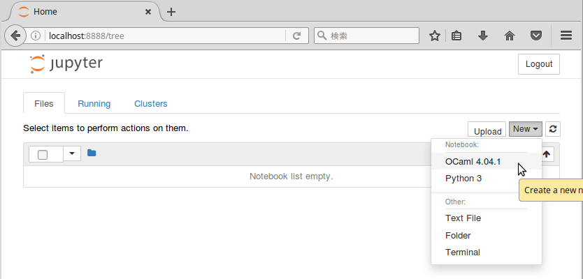

# [akabe/iocaml-datascience](https://hub.docker.com/r/akabe/iocaml-datascience/)

| Travis CI | MicroBadger |
| --- | --- |
| [](https://travis-ci.org/akabe/docker-iocaml-datascience) | [](https://microbadger.com/images/akabe/iocaml-datascience) |

A ready-to-use environment of [Jupyter](http://ipython.org/notebook.html) (IPython notebook) and [IOCaml](https://github.com/andrewray/iocaml) ([OCaml](https://ocaml.org/) kernel) with libraries for data science and machine learning.

## Getting started

First, launch a Jupyter server as follows.

```console
$ docker run -it -p 8888:8888 akabe/iocaml-datascience
[I 15:38:04.170 NotebookApp] Writing notebook server cookie secret to /home/opam/.local/share/jupyter/runtime/notebook_cookie_secret
[W 15:38:04.190 NotebookApp] WARNING: The notebook server is listening on all IP addresses and not using encryption. This is not recommended.
[I 15:38:04.197 NotebookApp] Serving notebooks from local directory: /notebooks
[I 15:38:04.197 NotebookApp] 0 active kernels
[I 15:38:04.197 NotebookApp] The Jupyter Notebook is running at: http://[all ip addresses on your system]:8888/?token=4df0fee0719115f474c8dd9f9281abed28db140d25f933e9
[I 15:38:04.197 NotebookApp] Use Control-C to stop this server and shut down all kernels (twice to skip confirmation).
[W 15:38:04.198 NotebookApp] No web browser found: could not locate runnable browser.
[C 15:38:04.198 NotebookApp]

    Copy/paste this URL into your browser when you connect for the first time,
    to login with a token:
        http://localhost:8888/?token=4df0fee0719115f474c8dd9f9281abed28db140d25f933e9
```

Second, access to the URL at the above last line to your web browser, then



You can create OCaml notebooks!

Notebooks on your host machine can be mounted to a Docker container by

```
docker run -it -p 8888:8888 -v $(pwd):/notebooks akabe/iocaml-datascience
```

## Distributions

The default `latest` version is the following distribution:

| Distribution | OCaml | OPAM | Command |
| ------------ | ----- | ---- | ------- |
| Alpine 3.5 | 4.04.1 | 1.2.2 | `docker pull akabe/iocaml-datascience` |

### Alpine

| Distribution | OCaml | OPAM | Command |
| ------------ | ----- | ---- | ------- |
| Alpine 3.5 | 4.05.0+trunk | 1.2.2 | `docker pull akabe/iocaml-datascience:alpine3.5_ocaml4.05.0` |
| Alpine 3.5 | 4.04.1 | 1.2.2 | `docker pull akabe/iocaml-datascience:alpine3.5_ocaml4.04.1` |
| Alpine 3.5 | 4.03.0 | 1.2.2 | `docker pull akabe/iocaml-datascience:alpine3.5_ocaml4.03.0` |

## Pre-installed packages

### Numerical computation

#### [Lacaml](http://mmottl.github.io/lacaml/) ([GitHub](https://github.com/mmottl/lacaml), [API](http://mmottl.github.io/lacaml/API.docdir/))

Binding to [BLAS](http://www.netlib.org/blas/) (Basic Linear Algebra Subprograms) and [LAPACK](http://www.netlib.org/lapack/) (Linear Algebra PACKage), traditional linear algebra libraries written in Fortran. This library supplies basic operations on vectors and matrices (e.g., addition, dot product, multiplication), LU, QR, SVD, least-square fitting, etc.

#### [SLAP](http://akabe.github.io/slap/) ([GitHub](https://github.com/akabe/slap), [API](http://akabe.github.io/slap/api/))

A high-level wrapper of Lacaml with type-based static size checks for vectors and matrices.

#### [GSL](http://mmottl.github.io/gsl-ocaml) ([GitHub](https://github.com/mmottl/gsl-ocaml), [API](http://mmottl.github.io/gsl-ocaml/api/))

Binding to [GNU Scientific Library (GSL)](http://www.gnu.org/software/gsl/), a rich numerical analysis library containing interface to BLAS. This library contains eigenproblem solvers, least square fitting, pseudo-random number generators (such as Mersenne Twister), FFT (fast Fourier transform), Monte-Carlo simulation, etc.

#### [L-BFGS](https://github.com/Chris00/L-BFGS-ocaml) ([API](http://lbfgs.forge.ocamlcore.org/API.docdir/Lbfgs.html))

Binding to [L-BFGS-B](http://users.iems.northwestern.edu/~nocedal/lbfgsb.html), a quasi-Newton library for bound-constrained optimization.

#### Ocephes ([GitHub](https://github.com/rleonid/ocephes), [API](https://rleonid.github.io/ocephes/))

Binding to [Ocephes](http://www.netlib.org/cephes/), a library of special math functions like Binominal, Gaussian, Gamma distributions, incomplete Beta integral.

#### [Oml](http://www.hammerlab.org/2015/08/11/introducing-oml-a-small-ocaml-library-for-numerical-computing/) ([GitHub](https://github.com/hammerlab/oml), [API](http://www.hammerlab.org/oml/index.html))

A small library for numerical computing on OCaml.

### Visualization

#### [Archimedes](http://archimedes.forge.ocamlcore.org/) ([API](http://archimedes.forge.ocamlcore.org/API/Archimedes.html))

A 2D plot library like matplotlib in Python. You can embed PNG images in Jupyter notebooks.

#### Cairo2 ([GitHub](https://github.com/Chris00/ocaml-cairo), [Tutorial](http://cairo.forge.ocamlcore.org/tutorial/index.html), [API](http://cairo.forge.ocamlcore.org/tutorial/Cairo.html))

Binding to [Cairo](https://cairographics.org/), a 2D vector graphics library. This library is useful as a backend of Archimedes.

## Contribution

If you know a widely-used numerical library in OCaml, find a bug, or have an idea to improve this environment, please create an issue or pull-request your changes.
